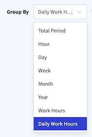
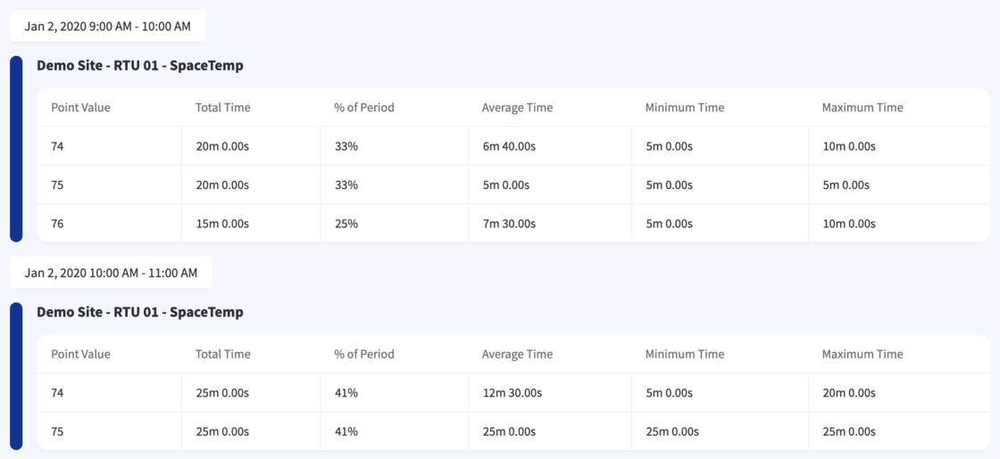
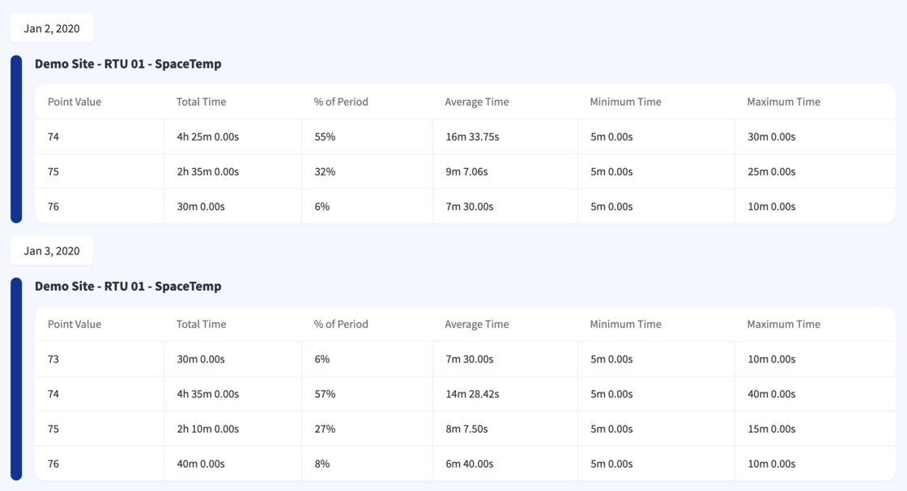

      

      

# Application Manual

**Version 1.0**

October 2020

            

Copyright © 2020 Facility Solutions Group, Inc. All Rights Reserved.

# Table Of Contents

<!-- TOC START min:1 max:4 link:true asterisk:false update:true -->
- [Application Manual](#application-manual)
- [Table Of Contents](#table-of-contents)
- [Getting Started](#getting-started)
  - [System Requirements](#system-requirements)
  - [Browser Compatibility](#browser-compatibility)
  - [Accessing Chariot®](#accessing-chariot)
  - [IT Network Information](#it-network-information)
    - [Frequently Asked Questions (‘FAQ’)](#frequently-asked-questions-faq)
    - [Application Architecture](#application-architecture)
- [User Manual](#user-manual)
  - [General Information](#general-information)
    - [About FSG Smart Buildings](#about-fsg-smart-buildings)
    - [Overview](#overview)
    - [References](#references)
    - [Permissions](#permissions)
    - [Points of Contact](#points-of-contact)
    - [Training ](#training)
  - [Global Navigation](#global-navigation)
    - [Dock](#dock)
    - [Site List](#site-list)
      - [Favorites](#favorites)
      - [Filters](#filters)
    - [Maps](#maps)
      - [Navigation](#navigation)
      - [Weather](#weather)
    - [Simple Site View](#simple-site-view)
  - [Site Controls](#site-controls)
    - [HVAC Equipment](#hvac-equipment)
      - [System Mode](#system-mode)
      - [Fan Mode](#fan-mode)
      - [Zone / Device View (HVAC)](#zone--device-view-hvac)
      - [Grid View (HVAC)](#grid-view-hvac)
    - [Lighting Control](#lighting-control)
      - [Lighting Zones](#lighting-zones)
      - [Controllable Device](#controllable-device)
      - [Read-Only Device](#read-only-device)
      - [Zone / Device View (Lighting)](#zone--device-view-lighting)
      - [Grid View (Lighting)](#grid-view-lighting)
    - [Cooler/Refrigeration Temps](#coolerrefrigeration-temps)
      - [Sensors](#sensors)
    - [Trash Compactors](#trash-compactors)
    - [“Deep Controls”  (Advanced Controls)](#deep-controls--advanced-controls)
    - [3 "Views" of Site Controls Page](#3-views-of-site-controls-page)
      - [Zones](#zones)
      - [Grid View](#grid-view)
      - [Table format](#table-format)
  - [Schedules](#schedules)
    - [Create Schedules](#create-schedules)
    - [Schedule Editor](#schedule-editor)
    - [Create Presets](#create-presets)
    - [Add/Remove Presets to Schedules](#addremove-presets-to-schedules)
    - [Mass Edit/Global Edits](#mass-editglobal-edits)
  - [Energy Dashboard](#energy-dashboard)
    - [Energy Trends](#energy-trends)
      - [Snapshots](#snapshots)
  - [Asset Manager](#asset-manager)
    - [Assets](#assets)
    - [Component (sub-assets)](#component-sub-assets)
    - [QR Code](#qr-code)
    - [Image & File Upload](#image--file-upload)
  - [Floor Plan](#floor-plan)
    - [Floor Plan Creation](#floor-plan-creation)
    - [Add / Remove Equipment From Floor Plan](#add--remove-equipment-from-floor-plan)
    - [Create new floor(s)](#create-new-floors)
  - [Site & Equipment Health](#site--equipment-health)
    - [Overview](#overview-1)
    - [Reporting and Trends](#reporting-and-trends)
      - [Navigation](#navigation-1)
      - [Line Chart](#line-chart)
      - [Bar Chart](#bar-chart)
      - [CSV](#csv)
      - [Heat map](#heat-map)
      - [Stopwatch/Pareto](#stopwatchpareto)
  - [Notifications](#notifications)
    - [Rule Creation](#rule-creation)
    - [Rule Deletion](#rule-deletion)
  - [User Administration](#user-administration)
    - [New Account](#new-account)
    - [Returning User](#returning-user)
    - [Password Reset](#password-reset)
    - [User Access & Permissions](#user-access--permissions)
    - [User Profiles](#user-profiles)
    - [Add User](#add-user)
    - [Delete User](#delete-user)
    - [Delegate Access](#delegate-access)
- [Appendix](#appendix)
  - [Chariot® Network FAQ](#chariot-network-faq)
  - [Glossary](#glossary)
  - [Index](#index)
<!-- TOC END -->

     

# Getting Started

**Version 1.0**

October 2020

## System Requirements

1. Computer, Laptop, Smart Phone, or Tablet with Internet Access.
2. Open Internet access on ports 80/443 to Chariot® compatible equipment on the connected site.

## Browser Compatibility

Chariot® is compatible with any modern web browser and does not require any software to be downloaded or installed.

Verified compatible browsers include:

*   Google Chrome
*   Mozilla Firefox
*   Internet Explorer
*   Safari

## Accessing Chariot®

Open any web browser on your computer, tablet or smartphone and navigate to your custom URL as shown below to access your instance of Chariot®.

_Example) `chotchkies.fsgchariot.app` or `acme.fsgchariot.app` or `demo.fsgchariot.app`_

**Credentials**

You should have received an invitation to create your Chariot account.

**Problems?**

Please contact [smart.support@fsgi.com](mailto:smart.support@fsgi.com) for assistance with login issues.

## IT Network Information

FSG has a very simple requirement for connectivity.  Open outbound internet access is all that is required.  This access can be provided in a variety of ways.

Method 1 
The preferred method is to utilize your existing network by provisioning a secure VLAN.  This allows only outbound traffic from our equipment that securely connects to our Google Cloud environment where the Chariot© platform lives.

Method 2 
Alternatively, open outbound internet access can be established from bringing in a separate ISP altogether.  By establishing an additional DSL line from your current provider, or a cellular modem from a wireless carrier, we can connect your facility’s equipment to our cloud network.

### Frequently Asked Questions (‘FAQ’)

1. **Q: My IT department doesn’t allow any 3rd party equipment on our network.  Can you meet this requirement?** 
Yes. If this is a constraint, FSG would suggest that connectivity Method 2 be used.  This creates a complete “air gap” from your existing network, where the two never touch.

2. **Q: Can I provide my own separate ISP connection?** 
Yes.  Many customers either provide their own terrestrial (landline) connection which yields the best performance.  Contingent upon network coverage, providing a cellular modem works just as well.  FSG has options to furnish this equipment as part of your Chariot© subscription should you elect to have us provide this as part of your package.

3. **How can I be sure that my network won’t get hacked?** 
FSG utilizes a secure VPN connection directly to our secured cloud environment.  This connection establishes an outbound only connection, ensuring that no incoming traffic is allowed.  Over this connection, all communication between your onsite equipment and the Chariot© platform takes place.

4. **Q:  What are the technical details supporting the security of the cloud environment?** 
Technically speaking, the system only requires an outbound connection to function limiting to external risk. The connection further uses ChaCha20 for symmetric encryption with Poly1305 for message authentication, a combination that’s more performant than AES on embedded CPU architectures that don’t have cryptographic hardware acceleration; Curve25519 for elliptic-curve Diffie-Hellman (ECDH) key agreement; BLAKE2s for hashing, which is faster than SHA-3; and a 1.5 Round Trip Time (1.5-RTT) handshake that’s based on the Noise framework and provides forward secrecy. It also includes built-in protection against key impersonation, denial-of-service and replay attacks, as well as some post-quantum cryptographic resistance.

### Application Architecture

     

# User Manual

**Version 1.0**

October 2020

## General Information

### About FSG Smart Buildings

FSG Smart Buildings, a division of Facility Solutions Group, provides building automation solutions for the commercial market. Our open controls solutions, powered by the Chariot platform, allow for real-time monitoring and analysis of building systems, including lighting, HVAC, refrigeration, air quality, metering, IoT sensors and more.

With automation solutions actively deployed in over 8,000 locations nationwide, FSG Smart Buildings empowers customers to see, manage and act to save money, reducing energy, operational and maintenance spend across their portfolio.

### Overview

This manual is a comprehensive guide to all the features within the Chariot® platform.  There are three main sections within this manual.

* **Getting Started** 
This section covers system requirements for use with the Chariot® platform as well as Browser Compatibility.

* **User Manual** 
This section is a detailed user guide to all of the Chariot® platform features.  It covers in depth how to use the advanced features such as global setpoints, advanced notifications, trending reports, and user administration.

* **Appendix** 
This section contains a Quick Reference Guide for the Chariot® platform in addition to the glossary and index of the manual.

### References

**Niagara  AX/4** 
The Niagara Framework is a universal software infrastructure that allows building controls integrators, HVAC and mechanical contractors to build custom, web-enabled applications for accessing, automating and controlling smart devices real-time via local network or over the Internet.  \
[https://www.tridium.com/products-services/niagara4](https://www.tridium.com/products-services/niagara4)

**ASHRA** 
ASHRAE, founded in 1894, is a global society advancing human well-being through sustainable technology for the built environment. The Society and its members focus on building systems, energy efficiency, indoor air quality, refrigeration and sustainability within the industry. Through research, standards writing, publishing and continuing education, ASHRAE shapes tomorrow’s built environment today. ASHRAE was formed as the American Society of Heating, Refrigerating and Air-Conditioning Engineers by the merger in 1959 of American Society of Heating and Air-Conditioning Engineers (ASHAE) founded in 1894 and The American Society of Refrigerating Engineers (ASRE) founded in 1904. \
[https://www.ashrae.org/](https://www.ashrae.org/) 

**ENERGY STAR®	ENERGY STAR®** 
The government-backed symbol for energy efficiency, providing simple, credible, and unbiased information that consumers and businesses rely on to make well-informed decisions. Thousands of industrial, commercial, utility, state, and local organizations—including about 40% of the Fortune 500®—partner with the U.S. Environmental Protection Agency (EPA) to deliver cost-saving energy efficiency solutions that improve air quality and protect the climate. Since 1992, ENERGY STAR and its partners helped American families and businesses save more than 4 trillion kilowatt-hours of electricity and achieve over 3.5 billion metric tons of greenhouse gas reductions, equivalent to the annual emissions of more than 750 million cars. In 2018 alone, ENERGY STAR and its partners helped Americans avoid $35 billion in energy costs. \
[https://www.energystar.gov/](https://www.energystar.gov/)

**Internet of Things (‘IoT’)** 
The Internet of things describes the network of physical objects - “things” - that are embedded with sensors, software, and other technologies for the purpose of connecting and exchanging data with other devices and systems over the Internet.

### Permissions

Access to Chariot® is restricted to use by authorized account users of FSG Smart Buildings.  All information contained herein is Confidential and any reproduction without authorization is expressly prohibited.

Chariot®  is a registered trademark of Facility Solutions Group, Inc.

Copyright © 2020 Facility Solutions Group, Inc. All Rights Reserved.

### Points of Contact

**Address** 
FSG Smart Buildings 
2590 Oakmont Dr., Ste. 214 
Round Rock, Texas 78665 

**Website** 
[https://fsgsmartbuildings.com](https://fsgsmartbuildings.com)

**Phone** 
(512) 835-6120 

**Sales** 
[info@fsgsmartbuildings.com](mailto:info@fsgsmartbuildings.com)

**Support** 
(888) 886-7274 
[smart.support@fsgi.com](mailto:smart.support@fsgi.com)

### Training 
Training sessions to review deeper functionality can be scheduled as needed.

For more information and training on other features such as trends & notifications please contact [smart.support@fsgi.com](mailto:smart.support@fsgi.com).

## Global Navigation

### Dock
|Icon       |Label       |Description      |
|-------|-------|------|
||Sites|•  Shows list of all sites.  = Online&nbsp;&nbsp;&nbsp;&nbsp;&nbsp;&nbsp; = Offline • Search by store number, city, state, etc. •  Click the  to toggle bookmarks to add a site to favorites list.|
||Health |See which sites are online/offline|
||Trends | See trends/histories of devices|
||Notifications | Setup notifications for alarm conditions|
||Mass Edit | Make global setpoint changes|
||Latest Changes | Log of updates/modifications|
||Users | User management (Admins only)|
||Profile | Change name, email, picture or password|
||Logout | Logout of Chariot®|
||Map | • Interactive map of all sites.  • Click or roll the mouse wheel to zoom into locations. Mouse over to see site info, local  weather, online status, and links.  • Select Map Layers  to toggle clouds, precipitation, pressure, wind, temperature.|

### Site List

The site list page provides and easy to filter the list of all portfolio sites and consists of a map and a list of locations.  Select a site from the list, or type any part of the store id, city, state, or address to immediately filter the list in place to quickly find the site you are looking for.

#### Favorites

Click the to toggle bookmarks to add a site to favorites.

#### Filters

Chariot® allows you to apply filters to the site list to show groups of sites that meet the designated criteria.  You can filter this to see only your favorite sites, or sites  in a specific city or state, as well as hide offline sites, or only show offline sites.

### Maps

#### Navigation

Selecting any of the clustered points on the map will zoom into that area automatically.

**Mouse over area cluster**

**Click to zoom into area**

#### Weather

Next to the site list is the map panel.  The map panel is intended to give a contextual way to navigate to sites quickly and easily by zooming into a location and clicking.  In the top right corner of the map is an icon that will toggle on/off the map layers.

**Available map layers are:** 

**Map with temperature layer selected**

**Map with precipitation layer selected**

### Simple Site View

The Chariot platform has the ability to default to a simpler site view if enabled. This streamlined view focuses on the on-site IoT devices and simplifies the experience of managing your sites. 

Users that have Simple Site View available to them will have a new user setting available to enable it. 

If you would like to have Simple Site View enabled, please email FSG Smart Buildings Support.

## Site Controls

### HVAC Equipment

#### System Mode

**Auto**

This mode automatically switches the HVAC equipment from heating to cooling to maintain the designated setpoints.

**Cooling**

This mode sets the HVAC equipment into cooling mode to satisfy the designated Cooling setpoint only.  Heat will not come on regardless of the space temp, until the lower safety temperature setpoint limit is reached.  The number following the System mode indicates the active stage of the system.

_Example, Cooling1 indicates the system is in active cooling stage 1.  Cooling2 indicates the system is in second stage active cooling._

**Heating**

This mode sets the HVAC equipment into Heating mode to satisfy the designated Heating setpoint only.  Heat will not come on regardless of the space temp, until the lower safety temperature setpoint limit is reached.  The number following the System mode indicates the active stage of the system.

_Example, Heating1 indicates the system is in active Heating stage 1.  Heating2 indicates the system is in second stage active Heating._

**Off**

This mode turns the HVAC equipment off.  It will not heat or cool while in this mode.

#### Fan Mode

**Auto**

This mode automatically switches the HVAC fan to run as required to circulate conditioned air and maintain humidity levels.

**Continuous**

This mode sets the HVAC fan to run continuously regardless of the system mode or compressor state.

**Off**

This mode turns the HVAC fan off.  It will not run while this setting is active.

#### Zone / Device View (HVAC)

#### Grid View (HVAC)

### Lighting Control

#### Lighting Zones

For contactor controlled lighting circuits, the named zones are listed in the control panel.  The zone names are customizable for each zone.  Individual device controls for lighting also will show in this location as well.  The lighting control panel will show all lighting zones connected to Chariot®.  There are two (2) main types of lighting devices that will show in the control panel.

#### Controllable Device
These devices have read/write capabilities and can accept a command from Chariot®.

#### Read-Only Device
These devices have read-only capability and cannot be overridden inside the Chariot® dashboard.

#### Zone / Device View (Lighting)

#### Grid View (Lighting)

### Cooler/Refrigeration Temps

#### Sensors

These are read-only devices that are reporting environmental information, typically temperature and humidity information.

##### Temperature & Humidity Sensors

See the status of the various pieces of equipment at a glance and easily observe live data as it updates the values in real-time.

By default, Temperature points have a display range of 0-100°F and Humidity points have a display range of 0-75%. These are able to be customized on a point-by-point basis per the needs of a particular site/situation.

### Trash Compactors
If available, trash compactor status components will report to Chariot. This allows you to quickly see the status of your trash compactors across your portfolio.

To enable this feature, pressure sensors must be installed in order to read the compaction pressure.  You can configure alerts from Chariot® to schedule bin pickups on demand rather than on a schedule saving thousands of dollars a year.

### “Deep Controls”  (Advanced Controls)

#### Zones

Grouped by configured "zones"

#### Devices

Grouped by device type

#### Grid View

This view is used if you want to see all devices at once in a grid format.  Very useful for locations with a lot of equipment.

#### Table format

Showing most data at once

## Schedules

### Create Schedules

### Schedule Editor

Chariot® has the ability to move and rearrange preset zones in a schedule by clicking and dragging. While the preset zone is highlighted, click anywhere and drag to move, immediately resolving collisions with other preset zones. To rearrange preset zones, click and drag the bottom handle while highlighted. This will "pop out" the zone until you are done dragging and only resolve conflicts after you are done placing it.

Additionally, hovering over a preset zone will reveal the name of the preset associated with the zone.

### Create Presets

### Add/Remove Presets to Schedules

### Mass Edit/Global Edits

This feature is very new and has several caveats based on system type. I'd suggest bringing up the page and discussing basic capabilities but not trying to live walk through the total flow.

## Energy Dashboard

This feature is near completion but is massively complex in the background. It will need hardening before we feel its rock solid. If you need to demo this before you hear otherwise please ask me, Adam, for help.

### Energy Trends

#### Snapshots

Basic 24 hour snapshot of meter metrics

## Asset Manager

### Assets

### Component (sub-assets)

### QR Code

### Image & File Upload

## Floor Plan

### Floor Plan Creation

### Add / Remove Equipment From Floor Plan

### Create new floor(s)

## Site & Equipment Health

### Overview

Any time you see the trend icon  you can select it to immediately jump to the Reporting and Trends section of Chariot®.  Once there, you can select the start / end dates and time zone you want to use.

### Reporting and Trends

#### Navigation

|Icon       |Label       |Description      |
|-------|-------|------|
||**Line Chart** |Shows line chart visualization of trend data.|
||**Bar Chart**|See bar chart visualization of trend data.|
||**Table / CSV**|See trends/history of devices.
||**Heat Map**|Setup Notifications for alarm conditions.
||**Stop Watch**|	Make global setpoint changes

####  Line Chart

##### Trendable Local Weather Data

In the Trends feature of Chariot, you can add local weather data to trends for sites that have latitude/longitude data associated with them.

With this additional context, you have better insight into the data being reported about the site.

#### Bar Chart

#### CSV

#### Heat map

#### Stopwatch/Pareto

##### Stopwatch Trends - Time Frame Grouping

Chariot® features time frame grouping in the Stopwatch Trends section. This allows you to break down the results into smaller chunks to get more insight into the data.

For example, this report from 10/14 - 10/21 can be viewed with the total period:

Or the same report can be viewed grouped by a smaller time period, for example, grouped by day:

CSV exports include all points on the report, as well as the time ranges for each of the stopwatch values.

##### Stopwatch Trends – Work Hours Support

Stopwatch Trends support equipment work hours. Individual equipment may have custom configurations, but by default, all equipment have work hours set to 9am - 5pm.

By selecting the "Work Hours" or "Daily Work Hours" options in the Stopwatch grouping selector, data shown will be limited to the configured work hours for each day in the report.

The "Work Hours" grouping option will show the values for each hour in the configured work hours individually.

The "Daily Work Hours" grouping option will combine all the data for a day into a single timeframe, giving a different way to digest the stopwatch data.

The"% of Period" column makes it easier to identify what values are most commonly held during a time period.

## Notifications

### Rule Creation

### Rule Deletion

## User Administration

### New Account

### Returning User

### Password Reset

### User Access & Permissions

### User Profiles

### Add User

### Delete User

### Delegate Access

# Appendix

**Version 1.0**

October 2020

## Chariot® Network FAQ

1.  **What are the network bandwidth and traffic frequency requirements for the platform?** 
  Average 1 GB  per month. Traffic is fairly continuous.

2.  **What are the network port requirements (number of required physical network connections)?** 
  1 physical port with outbound internet access and DNS resolution.

3.  **What are the IP requirements (number of addresses needed, does the solution support static IP)?** 
  System requires 1 static IP address.

4. **Does the solution require wireless connectivity (wifi)?** 
  Depending up on your specific site equipment, you may need to provide wifi if you have selected wireless devices.  Chariot can integrate both hard-wired and wireless systems.

5. **Does the solution require a phone line?** 
  No, the equipment uses an IP connection and relies on internet access.

6. **What are the firewall requirements (what ports are needed for reporting, remote access, etc)?** 
  1 physical port with outbound internet access and DNS resolution.

7. **What Web URLs require whitelisting?** 
  The only* whitelisted domain url needs to be `.fsgchariot.app` 
  _*(other urls may be specified for specific installations)_

8. **What are the remote methods of access required for the solution?** 
  The system only requires an outbound connection to function limiting to external risk. The connection further uses ChaCha20 for symmetric encryption with Poly1305 for message authentication, a combination that’s more performant than AES on embedded CPU architectures that don’t have cryptographic hardware acceleration; Curve25519 for elliptic-curve Diffie-Hellman (ECDH) key agreement; BLAKE2s for hashing, which is faster than SHA-3; and a 1.5 Round Trip Time (1.5-RTT) handshake that’s based on the Noise framework and provides forward secrecy. It also includes built-in protection against key impersonation, denial-of-service and replay attacks, as well as some post-quantum cryptographic resistance.

9. **Who has access to the system?** 
  Only authorized users have access to the system.

10. **What data does the system collect?** 
  The system collects time-series data for trending analysis and alarm notifications and histories of equipment performance.

11. **How is access authenticated (SSO, local accounts, etc)?** 
  FSG utilizes a secure VPN connection directly to our secured cloud environment.  This connection establishes an outbound only connection, ensuring that no incoming traffic is allowed.  Over this connection, all communication between your onsite equipment and the Chariot© platform takes place.

12. **Who maintains patching of the system and its components?** 
  All software patches are managed in the cloud or over secure connection to the local site’s VPN router.

13. What are the Operation Systems in use by the solution? \
  Answer goes here.
14. **Is the solution cloud based? If so, is it a managed solution or what are the management requirements necessary to facilitate the solution?** 
  Yes, it is a managed cloud solution.

15. **Does the solution have any requirements to build, manage, or maintain systems (servers, databases, etc)?  If so, please provide all requirements.** 
  No, it is all managed by FSG in it’s secure cloud environment.

16. **What application requirements exist for the solution?** 
  Chariot® is compatible with any modern web browser and does not require any software to be downloaded or installed.  
  _Verified compatible browsers include: Google Chrome, Mozilla Firefox, Internet Explorer, Safari_

## Glossary

## Index
